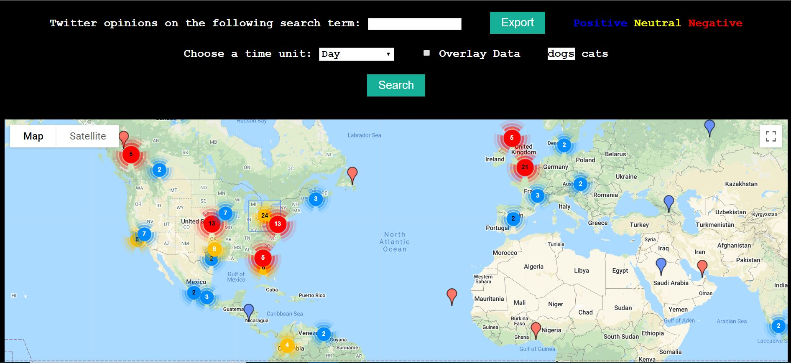
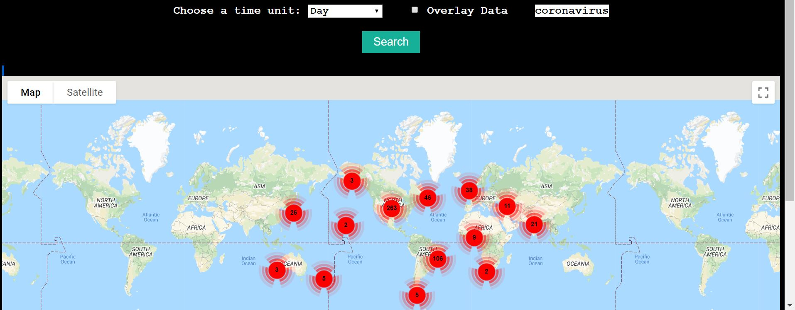

# Final Project - Alex Fatyga, Noah Malhi, Justin Morgan

Our twitter data mining project will essentially have a user input a search term for twitter and display a map of the US and point out what regions find this search term positive, negative or don't have enough data to backup a decision. We will be utilizing a Flask web application and AWS to host it on the cloud.

# User Stories
Companies want to see how the US views their brand. They may want to compare opinions from the past year to the past 6 months to the past month to see how opinions have changed.

# How To Use It
- In terminal, run pip3 install -r requirements.txt
- Put in Twitter keys in keys.py
- For first run, run python3 setup.py
- Then run python3 application.py
- Go into your web browser and go onto 127.0.0.1:5000

# Examples
An example of the map when 2 requests are overlayed using 100 tweets each:  
    
An example of the map with the request of coronavirus in the last 30 days and using 1000 tweets 
    

# How Did We Do It?
We started by making a python script using Tweepy that can take in a search term and return a list of tweets then we looked into getting the location of these tweets. The status and location (longitude and latitude) were grouped together into a list of lists that then could undergo sentiment analysis. After this simple python script was started, we then created a simple web application so that we can enter a location on the web app. Then we added in a drop down list so users can ask for the last day, 30 days, year or live update of tweets to be searched through and sent this to the python script so it could filter out tweets that were too old. Many lists are returned that the map adds

## Front End Requests
The user enters a search term, length of time and hits the submit button. 1000 tweets are retrieved and the date of them is checked to make sure they fit the time criteria. Sentiment analysis is called on the text of each and positive or negative is assigned. The location of the tweet runs through a geolocator to get an exact latitude and longitude. The longitude, latitude, actual location, and sentiment are put into a list and added to the overall list of lists. This list of lists is returned and is broken down to write to the excel file properly and send the correct information to the front end.
 
A user can hit the export button to download a zip file of excel files of all their requests to receive further information.

## Sentiment Analysis
Sentiment analysis is done by using the python library nltk. Before the web app begins, sentiment analysis is calibrated by using test data from the library. After a tweet is retrieved, a postive or negative sentiment is assigned to the tweet. 

## Data Grouping
Data grouping was done by using google maps clustering. Based on distance between the locations of the data points clusters would be made as you zoom in and zoom out on the map. Cluster color was determined by the majority sentiment in the cluster. If you click on a cluster you will zoom in into it and it will split into smaller clusters.

## Data Overlaying
To implement data overlaying, a variable was set either one or zero if overlay was checked off. If it was checked off, a copy of the previous data set was preserved into a temporaray list and the new data was fetched. Both lists were then sent to our javascript mapping function which would map both lists seperately. The two seperate groups were differentiated by text color within the clusters as well as all individial markers were labeled with the term search name.

## Twitter Live Streaming
Live streaming works by creating a stream listener object with the given search term. The app then streams live tweets until the given live count is reached, and then all of the live tweets are placed on the map as markers in the same way as the other options.

# Roles
- Alex => making tweepy api request, geocoding, export into an excel spreadsheet, improved sentiment analysis, front end view
- Justin => Sentiment analysis, live tweepy streaming
- Noah => Placing data points onto the map, grouping these data points together, data overlaying, front end map

# Sources
https://www.datacamp.com/community/tutorials/simplifying-sentiment-analysis-python
